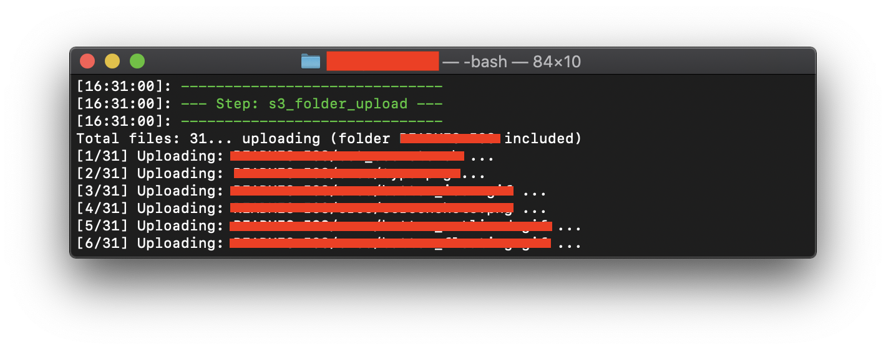

# s3_folder_upload plugin

[](https://rubygems.org/gems/fastlane-plugin-s3_folder_upload)



## Getting Started

This project is a [_fastlane_](https://github.com/fastlane/fastlane) plugin. To get started with `s3_folder_upload`, add it to your ***fastlane/Pluginfile***:

```bash
gem "fastlane-plugin-s3_folder_upload", git: "https://github.com/duyquang91/fastlane-plugin-s3_folder_upload"
```
Then install the plugin by this command:
```bash
$ bundle exec fastlane update_plugins
```

## About s3_folder_upload
By default, [aws-sdk-s3](https://docs.aws.amazon.com/AmazonS3/latest/dev/UploadObjSingleOpRuby.html) only support uploading a single file. This fastlane plugin was born to help you upload all files of a folder to S3 easily.

## Available options

| Parameter | Description | Environment variable | Default value |
|-----------|-------------|----------------------|---------------|
|aws_key | AWS Access key for authentication | AWS_ACCESS_KEY_ID | |
|aws_secret | AWS Access secret for authentication | AWS_SECRET_ACCESS_KEY | |
| bucket | AWS S3 Bucket to upload | | |
| region | AWS S3 Region of Bucket to upload | | |
| folder_path | Folder path to upload | | |
| create_bucket | Create a new bucket with given region in case the given bucket is not found | | true |
| include_folder | Upload files in sub-folders or not | | true |
| thread_count | Number of thread to upload files | | 5 |
| verbose | Puts message while uploading files | | true |

To get more available options, please run this command:
```bash
$ bundle exec fastlane action s3_folder_upload
```

Example:
```bash
s3_folder_upload(folder_path: "Builds",
                      bucket: "My-Bucket",
                      region: "ap-southeast-1")
```

## Run tests for this plugin

To run both the tests, and code style validation, run

```
rake
```

To automatically fix many of the styling issues, use
```
rubocop -a
```

## Issues and Feedback

For any other issues and feedback about this plugin, please submit it to this repository.

## Troubleshooting

If you have trouble using plugins, check out the [Plugins Troubleshooting](https://docs.fastlane.tools/plugins/plugins-troubleshooting/) guide.

## Using _fastlane_ Plugins

For more information about how the `fastlane` plugin system works, check out the [Plugins documentation](https://docs.fastlane.tools/plugins/create-plugin/).

## About _fastlane_

_fastlane_ is the easiest way to automate beta deployments and releases for your iOS and Android apps. To learn more, check out [fastlane.tools](https://fastlane.tools).
